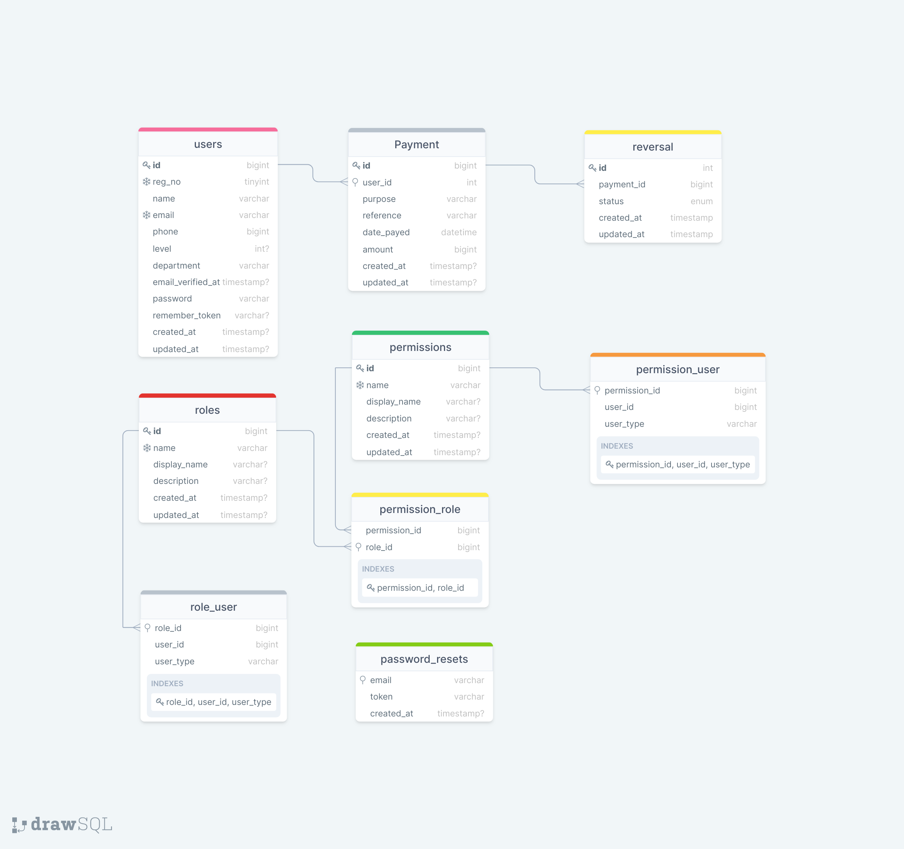
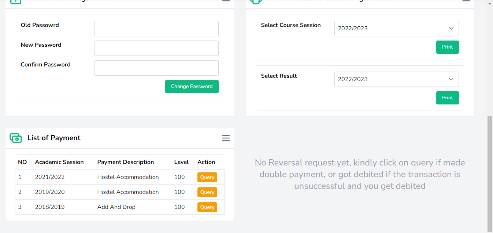

<!-- <p align="center"><a href="https://laravel.com" target="_blank"></a></p>

<p align="center">
<a href="https://travis-ci.org/laravel/framework"></a>
<a href="https://packagist.org/packages/laravel/framework"></a>
<a href="https://packagist.org/packages/laravel/framework"></a>
<a href="https://packagist.org/packages/laravel/framework"></a>
</p>

## About Laravel

Laravel is a web application framework with expressive, elegant syntax. We believe development must be an enjoyable and creative experience to be truly fulfilling. Laravel takes the pain out of development by easing common tasks used in many web projects, such as:

- [Simple, fast routing engine](https://laravel.com/docs/routing).
- [Powerful dependency injection container](https://laravel.com/docs/container).
- Multiple back-ends for [session](https://laravel.com/docs/session) and [cache](https://laravel.com/docs/cache) storage.
- Expressive, intuitive [database ORM](https://laravel.com/docs/eloquent).
- Database agnostic [schema migrations](https://laravel.com/docs/migrations).
- [Robust background job processing](https://laravel.com/docs/queues).
- [Real-time event broadcasting](https://laravel.com/docs/broadcasting).

Laravel is accessible, powerful, and provides tools required for large, robust applications.

## Learning Laravel

Laravel has the most extensive and thorough [documentation](https://laravel.com/docs) and video tutorial library of all modern web application frameworks, making it a breeze to get started with the framework.

If you don't feel like reading, [Laracasts](https://laracasts.com) can help. Laracasts contains over 1500 video tutorials on a range of topics including Laravel, modern PHP, unit testing, and JavaScript. Boost your skills by digging into our comprehensive video library.

## Laravel Sponsors

We would like to extend our thanks to the following sponsors for funding Laravel development. If you are interested in becoming a sponsor, please visit the Laravel [Patreon page](https://patreon.com/taylorotwell).

### Premium Partners

- **[Vehikl](https://vehikl.com/)**
- **[Tighten Co.](https://tighten.co)**
- **[Kirschbaum Development Group](https://kirschbaumdevelopment.com)**
- **[64 Robots](https://64robots.com)**
- **[Cubet Techno Labs](https://cubettech.com)**
- **[Cyber-Duck](https://cyber-duck.co.uk)**
- **[Many](https://www.many.co.uk)**
- **[Webdock, Fast VPS Hosting](https://www.webdock.io/en)**
- **[DevSquad](https://devsquad.com)**
- **[Curotec](https://www.curotec.com/services/technologies/laravel/)**
- **[OP.GG](https://op.gg)**
- **[CMS Max](https://www.cmsmax.com/)**
- **[WebReinvent](https://webreinvent.com/?utm_source=laravel&utm_medium=github&utm_campaign=patreon-sponsors)**
- **[Lendio](https://lendio.com)**
- **[Romega Software](https://romegasoftware.com)**

## Contributing

Thank you for considering contributing to the Laravel framework! The contribution guide can be found in the [Laravel documentation](https://laravel.com/docs/contributions).

## Code of Conduct

In order to ensure that the Laravel community is welcoming to all, please review and abide by the [Code of Conduct](https://laravel.com/docs/contributions#code-of-conduct).

## Security Vulnerabilities

If you discover a security vulnerability within Laravel, please send an e-mail to Taylor Otwell via [taylor@laravel.com](mailto:taylor@laravel.com). All security vulnerabilities will be promptly addressed.

## License

The Laravel framework is open-sourced software licensed under the [MIT license](https://opensource.org/licenses/MIT). -->

<div style="width:100%; max-width: 1024px; margin: 2px auto; padding: 10px; border: 1px #eee solid; border-radius:8px">

# APRS (Automated Payment Revasal System)
### Imagine not having to panic when there is an issue with payments as a student. Occasionally student face challanges making payment for various things on the portal, and when this happens such sudent goes through physical, mental and emotional stress, to clear the issue such student might need to make numerous trips to the bank and to school. 
### The APRS system is a glitch free software that is designed to provide students who might have any issue with payments on the school portal be it unsucessful payment, double payment etc with a platforn to issue a complaint about such payment and receive immediate attention from the school and the bank without having to make trips to anywhere. Simply login to the platform from the comfort of your own device aanywhere and you will havve access to both your school and the bank. 
### The APRS software is a platform that links the student, school and the bank providing a seamless way of making complaints with just a few clicks you will be connected to right people who can help you out. Not only does our software save time and effort, it also ensures that your concerns are addressed promtly. It's all about making things easier for students.  

## System Requirements

### The system requirements are divided into two:

The minimum system requirement for this application to run is any system(PC) that possess the following attributes

1. **Hardware Requirements**
    - 1gb ram system
    - 20gb rom
    - 1.2ghz processor and above
2. **Sofware Requirements**
    - A Web Server e.g wamp,xamp, laragon etc.
    - PHP V8 and above
    - MySQL Database
    - Composer
    - Git (optional if you are cloning from github)

## System Architechure

System architecture is a high-level design or blueprint that outlines the structure, components, and interactions of a system, helping to define how it will function and meet its objectives. It serves as a roadmap for designing and building complex systems, providing a clear and organized framework for development

### Use case diagram

A use case diagram is a diagram that shows the interaction between users and a system, it also helps to understand how the system is used and different actions it can perform.


### Data flow diagram

A Data flow diagram shows how data moves through a system. It illustrates the flow of information between different processes, data sources and data destinations.


### ERD (Entity Relationship diagram)
This diagram shows the relationship between entities in a database. It helps to understand the structure and organisation of data in a database system.


## Installation Guide

To install this software the system(PC) should possess the system requirements listed above.

Running this software project from GitHub involves a few steps. You can do this by either cloning the repository using Git or by downloading the project as a ZIP file.

### Method 1: Cloning the Repository

**STEP 1: Clone project**

```sh
## Open your terminal and navigate to your project directory

cd your_project_directory

git clone https://github.com/oyenet1/course_allocation.git

# Navigate to the project folder
cd course_allocation
```

**STEP 2: Set Up the Environment Configuration**

```sh
#Copy the .env.example file to a new .env file:
cp .env.example .env
```

**STEP 3: Install Project Dependencies**

```sh
#Run composer install
composer install
```

**STEP 4: Set Up the Environment Configuration**

```sh
#Generate an application key:
php artisan key:generate
```

**STEP 5: Create the Database**

Create a new database on your local database server. Update the database connection information in the `.env` file:

```sh
DB_CONNECTION=mysql
DB_HOST=127.0.0.1
DB_PORT=3306
DB_DATABASE=your_database_name
DB_USERNAME=your_database_username
DB_PASSWORD=your_database_password
```

**Step 6: Run Database Migrations and Seeders**

The command below below will create tables and seed the tables with dummy data

```sh
    php artisan migrate:fresh --seed
```

**Step 7: Start the Local Development Server**

```sh
    php artisan serve
```

**Step 8: Access Your Laravel Application**

Open a web browser and navigate to `http://127.0.0.1:8000` or the URL provided by the Laravel development server. You should see your Laravel application up and running locally

By default, Laravel will start the development server on `http://127.0.0.1:8000`

### Method 2: Downloading as a ZIP File
**Step 1: Go to the github repositoty**
```sh
#Navigate to the GitHub repository of the project
Download the project as a ZIP file.
```
**Step 2: Extract and save the file**
```sh
Extract the ZIP file 
Into the the www folder of laragon 

```

```sh
After successful download of the project, Follow from step 2 of method 1. 
```
## Features and Usage
The software has three(3) types of users the school(admin), the bank and the student(s). Here are some of the feautures of each. 

**As a student**
Every student on the system has a profile which shows the basic information about them on the system.

 * Payment Query
 Students make query on any payment on their profile and wait for reversal. 

When a query has been made for reversal.

While the payment query is processing the status of any payment that has been quereied will be processing. 

When the payment reversal request has been approved, the status of the payment changes to approved.


**As an Admin(School)**
The admis has access to the students on the system and the payments that have been made and payments that was queried. The Admin can delete a student from the system if need be.  


**As The Bank**
The bank has the sole responsibility of approving or denying payment reversal query. 


